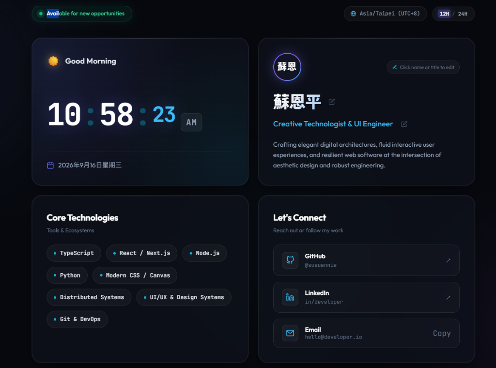

# Personal Showcase & Live Clock

A sleek, responsive personal showcase dashboard built with modern HTML5, Vanilla CSS, and JavaScript.



## ✨ Highlights
- **Live Synchronized Clock**: Precise real-time digital clock with 12h/24h toggle, animated separators, and pulsing seconds.
- **Contextual Greeting**: Dynamic greeting based on the current hour of the day (Morning, Afternoon, Evening, Night).
- **Timezone Detection**: Automatically displays the visitor's local timezone and UTC offset.
- **Editable Profile**: Real-time click-to-edit name and title with `localStorage` persistence.
- **Rich Dark Aesthetics**: Glassmorphism design, floating ambient glows, and responsive typography (`Outfit` & `JetBrains Mono`).
- **Interactive Stack & Links**: Core tech badges, GitHub profile link, and one-click email copy with toast confirmation.

## 🚀 Getting Started

Simply open `index.html` in any modern web browser, or serve it locally:

```bash
# Using Python
python -m http.server 8085

# Using Node.js
npx serve .
```

Then visit [http://localhost:8085](http://localhost:8085).

## 🛠️ Tech Stack
- **Structure**: Semantic HTML5
- **Style**: Custom Vanilla CSS (Glassmorphism, CSS Variables, Flexbox & CSS Grid)
- **Logic**: Vanilla ES6+ JavaScript
- **Fonts**: Google Fonts (`Outfit`, `JetBrains Mono`)
